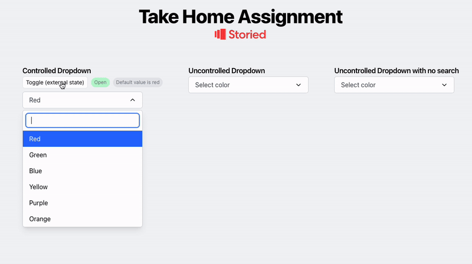

# 🎨 Dropdown Select Component

## Introduction

A fully accessible, customizable dropdown select component built with Next.js, TypeScript, and Tailwind CSS.

## Live demo

https://dropdown-facundo.vercel.app



## 🛠️ Installation

```bash
git clone https://github.com/facuperezm/take-home-challenge.git

cd take-home-challenge

pnpm i

pnpm test

pnpm dev
```

### Basic Usage

```tsx
import { DropdownSelect } from "@your-package/dropdown-select";

const options = [
  { value: "red", label: "Red" },
  { value: "blue", label: "Blue" },
  { value: "green", label: "Green" },
];

function App() {
  return (
    <DropdownSelect
      label="Select a color"
      options={options}
      onChange={(value) => console.log(value)}
      isSearchable
    />
  );
}
```

### Controlled Mode

```tsx
function App() {
  const [value, setValue] = useState("red");
  const [isOpen, setIsOpen] = useState(false);

  return (
    <DropdownSelect
      label="Select a color"
      options={options}
      value={value}
      open={isOpen}
      onChange={setValue}
      onOpenChange={setIsOpen}
      isSearchable
    />
  );
}
```

## 🎮 Props

| Prop           | Type                                      | Default  | Description                                 |
| -------------- | ----------------------------------------- | -------- | ------------------------------------------- |
| `label`        | `string`                                  | Required | Placeholder text when no option is selected |
| `options`      | `Array<{ value: string, label: string }>` | Required | Array of options to display                 |
| `onChange`     | `(value: string) => void`                 | Required | Callback when selection changes             |
| `isSearchable` | `boolean`                                 | `false`  | Enable search functionality                 |
| `value`        | `string`                                  | -        | Controlled mode: selected value             |
| `open`         | `boolean`                                 | -        | Controlled mode: dropdown open state        |
| `onOpenChange` | `(isOpen: boolean) => void`               | -        | Controlled mode: open state callback        |

## Author

- [Facundo Perez Montalvo](https://facuperezm.com)

[](https://facuperezm.com)
[](https://www.linkedin.com/in/facuperezm/)
